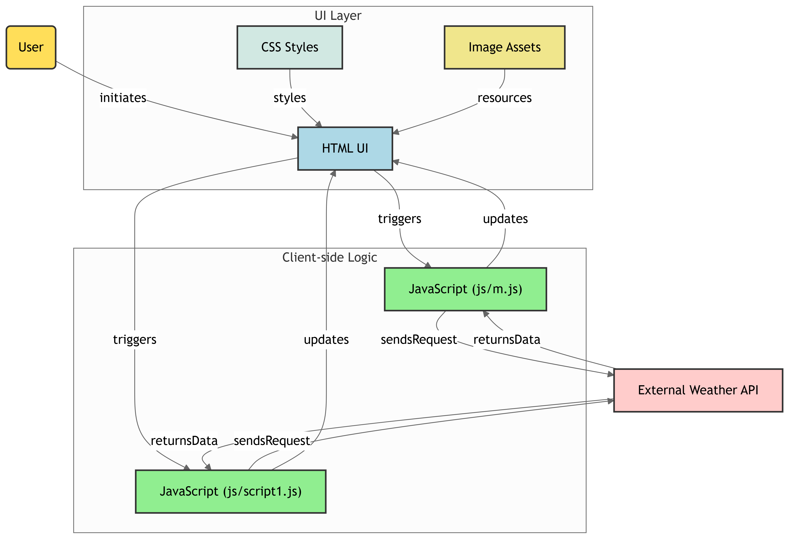
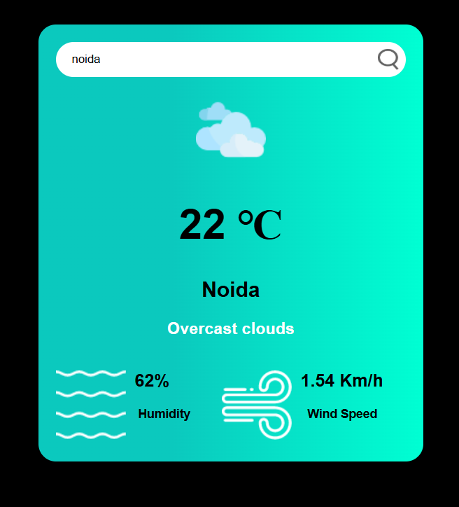

# Weather App Frontend Architecture

This project demonstrates a frontend web application that interacts with an **External Weather API** to fetch and display real-time weather information. The system is structured into different layers: **UI Layer** and **Client-side Logic**, with clear separation of concerns.

---


## 📂 Project Structure

```
project-root/
│
├── index.html          # Main HTML UI
├── css/
│   └── styles.css      # CSS styles for UI layer
├── images/             # Image assets for UI
│
├── js/
│   ├── m.js            # Main JavaScript logic for handling events & API calls
│   └── script1.js      # Additional JS logic (helpers, secondary interactions)
│
└── README.md           # Documentation
```

---

## 📌 Architecture Diagram  

  


### 1. **UI Layer**
- **HTML UI**  
  Provides the base structure of the application.  
- **CSS Styles**  
  Applies design and visual styling to the HTML UI.  
- **Image Assets**  
  Supplies visual resources like icons, weather graphics, etc.

### 2. **Client-side Logic**
- **JavaScript (js/m.js)**  
  - Handles primary logic for fetching weather data.  
  - Sends requests to the **External Weather API**.  
  - Updates the **HTML UI** with returned data.  
- **JavaScript (js/script1.js)**  
  - Contains supporting logic.  
  - Handles additional triggers from the UI.  
  - Sends and receives API requests as needed.

### 3. **External Weather API**
- Provides weather data (temperature, humidity, conditions, etc.).  
- The app consumes API responses via JavaScript.  

---

## 🔄 Data Flow

1. **User** initiates interaction with the **HTML UI**.  
2. **HTML UI** triggers client-side logic (`m.js` / `script1.js`).  
3. JavaScript files:  
   - **Send API requests** to the **External Weather API**.  
   - **Receive data** and update the **HTML UI** accordingly.  
4. **CSS** applies styling, and **Image assets** enhance visuals.  

---

## 🚀 How to Run

1. Clone this repository:
   ```bash
   git clone <repo-url>
   cd project-root
   ```
2. Open `index.html` in a browser.  
3. Ensure JavaScript is enabled.  
4. (Optional) Replace API keys in `m.js` with your own **External Weather API key**.

---

## 🛠️ Technologies Used
- **HTML5** – UI structure  
- **CSS3** – Styling and layout  
- **JavaScript (ES6)** – Client-side logic  
- **External Weather API** – Real-time weather data  

---


## 📌 Output

  

---

## 📌 Notes
- Ensure you have a valid API key for the weather API.  
- Customize styles in `css/styles.css` for branding.  
- Extend `script1.js` for advanced interactions (e.g., caching, geolocation).  
